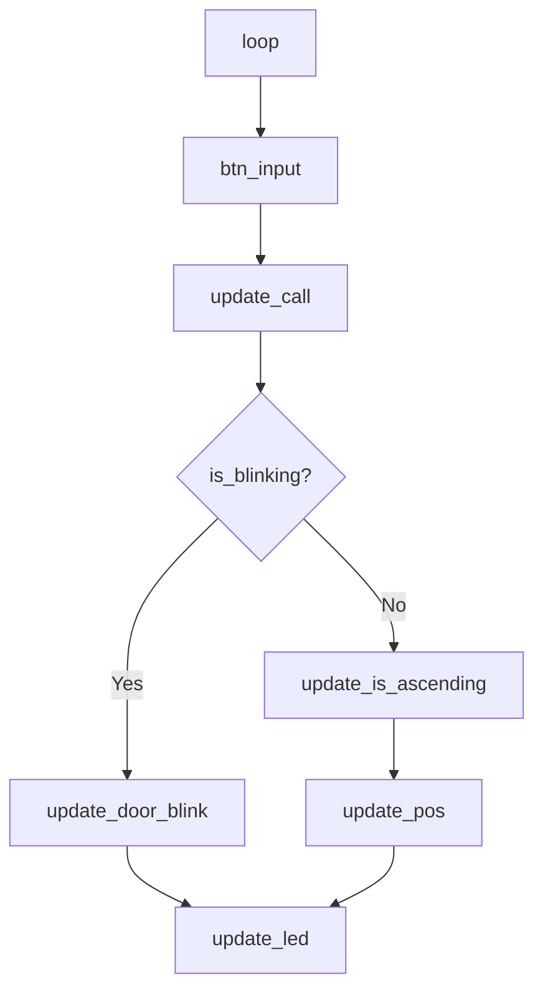
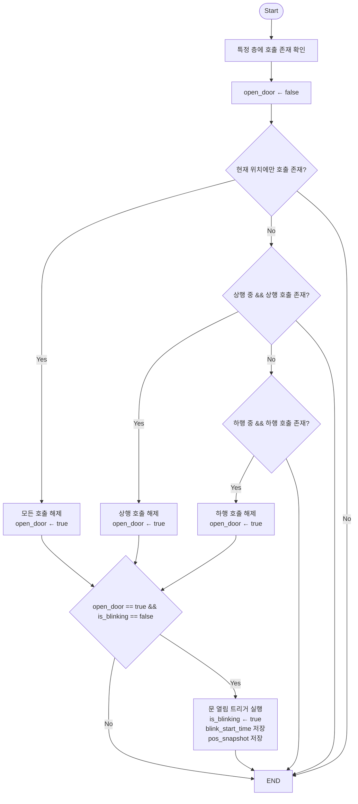
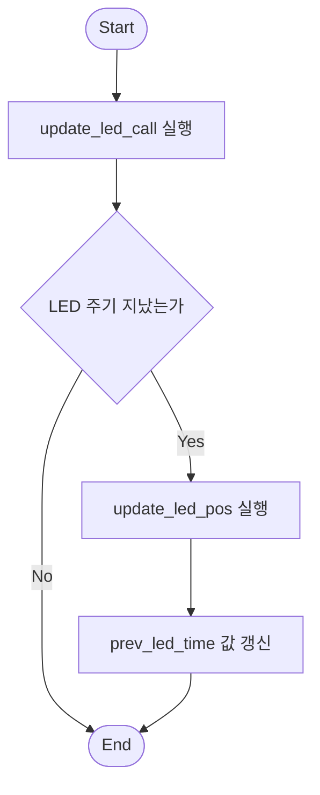
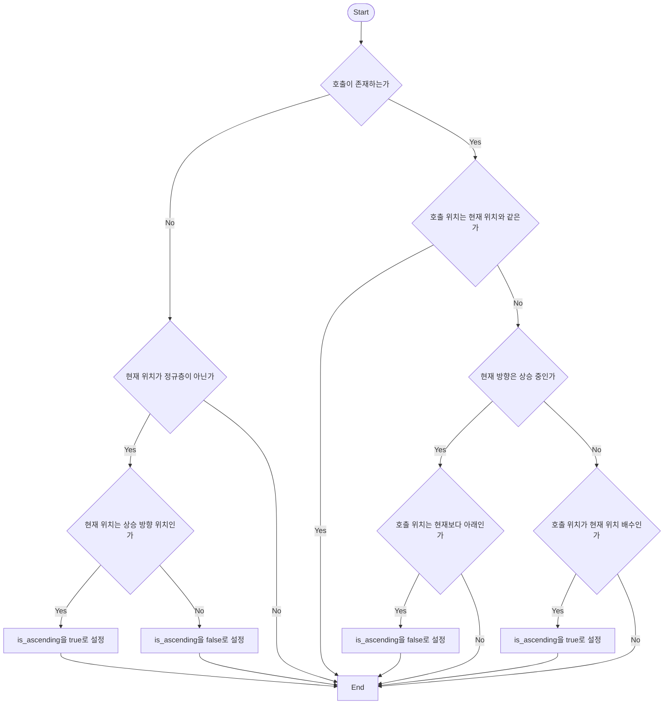
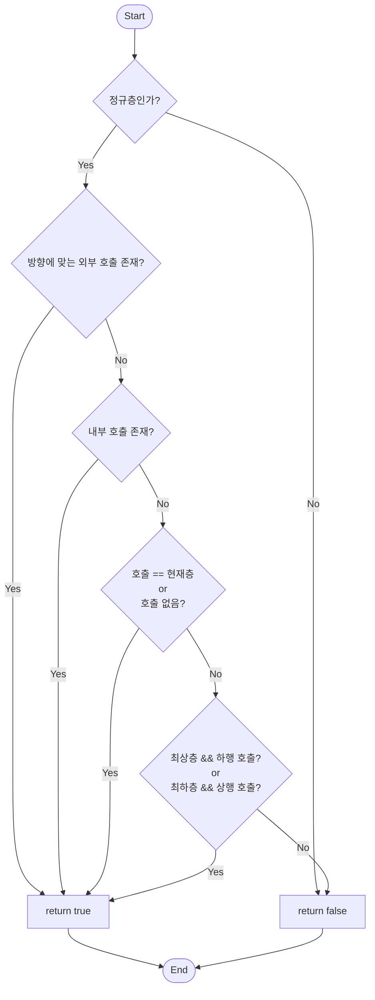
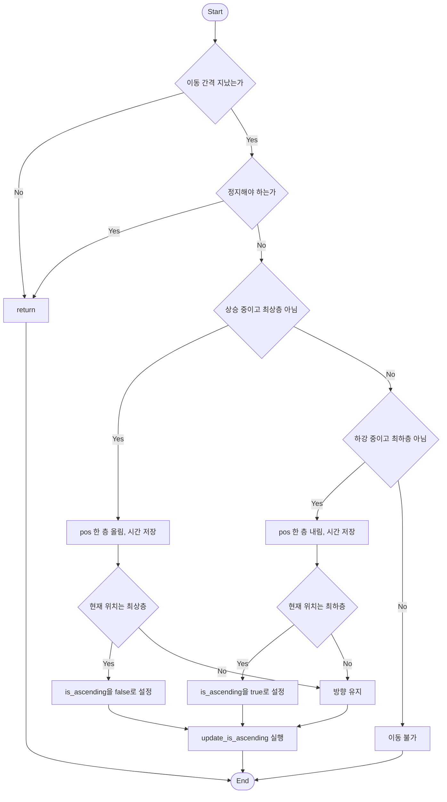
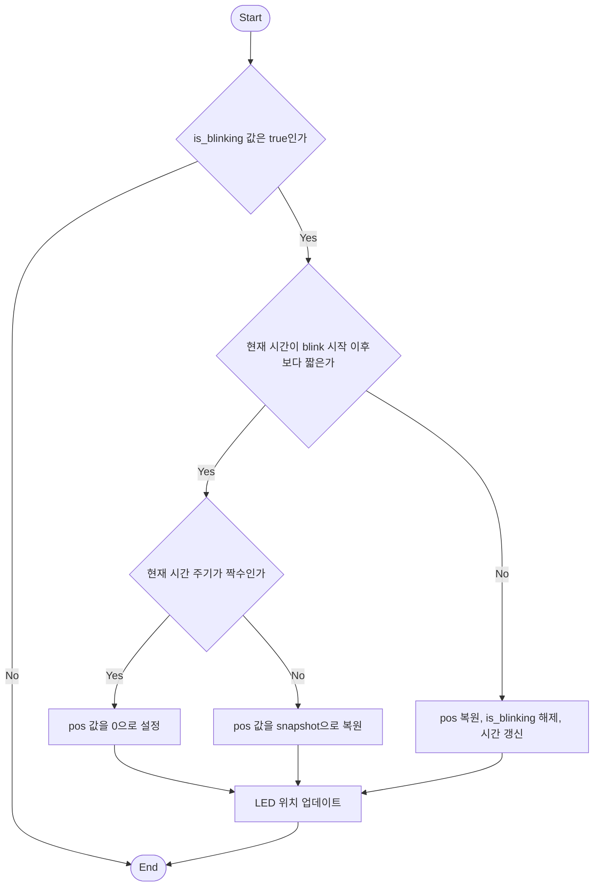

# 🛗 아두이노 엘리베이터 시스템

> **📅 프로젝트 기간: 2025.04.15 ~ 2025.04.16 (1Day Project)**

## 📌 개요

본 프로젝트는 아두이노 기반으로 제작된 **3층 엘리베이터 제어 시스템**입니다.  
**내부 호출 버튼**, **외부 상/하행 버튼**, **호출/위치 LED**, **비트 기반 상태 제어**, **millis() 기반 비동기 처리**, **층간 애니메이션 제어** 기능을 포함하며, 실제 엘리베이터의 호출 우선순위 및 방향 전환 규칙을 그대로 반영한 구조로 설계되었습니다.

> - 비트 기반 상태 관리 (`byte`, `bitRead`, `bitWrite`)
> - millis() 기반 비동기 흐름
> - 층간 이동: `<<`, `>>` 시프트 연산
> - 호출 우선순위 기반 방향 결정 (`call > pos`, `call % pos == 0`)

---

## 🎯 프로젝트 목적 및 설계 철학

본 프로젝트는 현실 엘리베이터의 동작 원리를 아두이노로 **구조적이고 논리적으로 재현**하는 것을 목표로 하며, 다음 세 가지 설계 철학을 바탕으로 구현되었습니다:

1. **현실 규칙의 준수**  
   - 호출 우선순위, 방향 전환, 호출 해제 및 문 열림 조건 등 **현실 엘리베이터의 규칙을 그대로 구현**

2. **구조적 코드 설계**  
   - 호출/위치/방향/애니메이션을 독립된 함수로 분리하여 **유지보수성 향상** 및 **정확한 동작 흐름 구현**

3. **비트 기반 최적화 처리**  
   - 상태를 `byte` 변수로 관리하며, **비트 연산을 통한 효율적 상태 제어와 최소한의 조건문** 구현
  
---   

## 🧩 회로 구성


| 구성 요소 | 설명 |
|-----------|------|
| **외부 버튼** | 각 층의 상행/하행 호출 버튼 (토글 방식) |
| **내부 버튼** | 목적층 선택 (취소 불가, 도착 시 자동 해제) |
| **위치 LED** | 현재 위치 또는 이동 중인 층 표시 |
| **호출 LED** | 호출 등록 여부 표시 (자동 OFF) |

---

## 🚪 주요 기능

| #  | 분류                       | System Requirements 내용                                                                 |
|----|----------------------------|------------------------------------------------------------------------------------------|
| 1  | 호출 등록 및 사용자 취소 처리 | 1-1. 외부 및 내부 버튼으로 호출을 등록하는 기능<br>1-2. 외부 버튼을 다시 눌러 호출을 취소하는 기능 |
| 2  | LED를 통한 상태 출력         | 2-1. 현재 위치에 따라 위치 LED를 표시하는 기능<br>2-2. 호출 상태에 따라 호출 LED를 표시하는 기능 |
| 3  | 방향 판단                  | 3-1. 위치 및 호출 상태를 기반으로 이동 방향을 판단하는 기능<br>3-2. 최상층/최하층 도달 시 자동으로 방향을 전환하는 기능 |
| 4  | 이동 및 정지 판단           | 4-1. 다음 이동 주기에 이동 여부를 판단하는 기능<br>4-2. 정규층이 아닌 층(층 사이)에서는 정지하지 않는 기능 |
| 5  | 호출 해제                 | 5-1. 도착한 층에서 호출을 해제하는 기능                                                |
| 6  | 문 열림 애니메이션          | 6-1. 호출 처리 후 문이 열리는 동작을 표현하는 기능                                      |

---

## 🧠 기능별 구현 함수 요약

| 기능                           | 담당 함수                           |
|--------------------------------|--------------------------------------|
| 호출 버튼 입력 처리            | `btn_input()`                        |
| 호출 해제 처리                | `update_call()`                      |
| 문 열림 애니메이션             | `update_door_blink()`                |
| 이동 방향 판단                | `update_is_ascending()`              |
| 위치 이동                     | `update_pos()`                       |
| LED 상태 갱신                 | `update_led()`, `update_led_pos()`, `update_led_call()` |
| 디버깅용 시리얼 출력           | `print_state()`, `print_floor()`     |

---

## 🏢 현실 엘리베이터와의 규칙 비교

| 항목               | 현실 엘리베이터                                   | 본 프로젝트 구현 (User Requirement) |
|--------------------|--------------------------------------------------|------------------------------|
| 호출 취소 (외부)    | 불가 (※ 일부 시스템에서는 가능)                   | 가능                         |
| 호출 취소 (내부)    | 불가                                             | 불가                         |
| 호출 해제 시점 (외부) | 이동 방향이 호출 방향과 같을 때만 해제             | 동일                         |
| 호출 해제 시점 (내부) | 도착 시 항상 해제                                 | 동일                         |
| 문 열림 중 입력 가능 | 가능                                             | 가능                         |
| 방향 전환 조건       | 현재 방향에 호출이 없으면 반대 방향으로 전환       | 동일                         |
| 호출층 도착시 동작   | 실제 문 열림                                     | LED 애니메이션 처리           |

---

## ⚙️ 설계 특징

### 🔸 기능별 함수 분리 (구조적 설계)

전체 시스템은 loop 내부에서 **순차적 함수 호출만 수행**하며, 각 함수는 자신의 조건 판단과 처리를 **독립적으로 수행**하도록 설계되었습니다.

```
void loop() {  
 btn_input();  
 update_call();  
 update_door_blink();  
 if (!is_blinking) {  
  update_is_ascending();  
  update_pos();  
 }  
 update_led();  
}
```

> loop는 흐름의 순서만 유지하고, 각 기능은 자체 조건에서만 동작함으로써 **가독성, 유지보수성, 기능 격리성**을 모두 확보하였습니다.

---

### 🔸 millis() 기반 비동기 제어

시스템 내 모든 시간 제어는 millis() 값을 이용해 **독립적인 주기 관리**로 구현되어 있습니다.  
delay 사용 없이, **이동 / 깜빡임 / LED 갱신** 등 모든 동작을 자기 주기로 판단합니다.

| 동작 항목         | 제어 조건 표현                                 |
|------------------|-------------------------------------------------|
| 위치 이동         | millis() - prev_move_time > MOVING_INTERVAL   |
| 문 열림 LED 깜빡임 | (millis() / BLINK_INTERVAL) % 2 == 0           |
| 문 열림 종료       | millis() - blink_start_time > BLINK_DURATION  |
| LED 주기 갱신     | millis() - prev_led_time > MOVING_INTERVAL    |

> 각 동작이 **자신의 주기 변수**만 참조하기 때문에 동시 동작이 충돌 없이 처리됩니다.

---

### 🔸 비트 플래그 기반 상태 표현

pos, up_call, down_call, inner_call 모두 byte(혹은 unsigned long)로 선언되어  
상태는 **비트 단위로 저장되고 연산**되며, 조건 판단 또한 **논리 연산으로만 구성**됩니다.

```
pos        = 00000100  (2층)  
up_call    = 00000001  (1층 상행 호출)  
down_call  = 00100000  (5층 하행 호출)  
inner_call = 00000010  (1층 내부 호출)  
call = up_call | down_call | inner_call = 00100011
```
- 위쪽 호출 존재 여부 → call > pos  
- 아래쪽 호출 존재 여부 → call % pos == 0  
- 현재 위치에 호출 존재 여부 → call & pos != 0

> 이처럼 별도 배열이나 조건문 없이 **한 줄 비트 연산으로 호출 위치 판단이 가능**합니다.

---

### 🔸 출력/애니메이션의 일관성

LED 상태 출력은 별도 제어문 없이 pos, call 값에 따라 자동 결정됩니다.

| 항목 | 처리 방식                      |
|------|--------------------------------|
| 위치 LED   | bitRead(pos, i)             |
| 호출 LED   | bitRead(call, 3*i)          |
| 문 열림 애니메이션 | pos = 0 ↔ pos_snapshot 토글 |

> pos = 0 으로 깜빡이게 하고, 이후 다시 snapshot으로 복원함으로써  
> LED 깜빡임도 별도 상태 변수 없이 간결하게 구현됩니다.

## 🔍 핵심 설계 요약

| 항목     | 구현 전략 요약 |
|----------|----------------|
| **속도** | 비트 연산 기반 호출 판단 → 빠름 |
| **단순성** | pos, call 중심 상태 표현 통합 |
| **확장성** | byte → unsigned long 확장 시 64층 이상 가능 |
| **일관성** | 호출 등록, 정지 판단, LED 제어 모두 동일 비트 기반 처리 |

---

## 🔄 전체 동작 흐름



---

## 🔧 함수별 동작 흐름

### 🔹 update_call()


### 🔹 update_led()


### 🔹 update_is_ascending()


### 🔹 stay()


### 🔹 update_pos()


### 🔹 update_door_blink()


---

## 🧪 예시 흐름: 1층에서 3층 호출

```
1. 호출 등록: BTN_UP_F1 누름 → bitWrite(up_call, 0, 1)
2. 방향 판단: call > pos → is_ascending = true
3. 위치 이동: 500ms 간격으로 pos <<= 1 (1층 → 1.1층 → ...)
4. 도착 판단: pos == 3층 && (up_call & pos) → stay() == true
5. 호출 해제: update_call()으로 up_call 해제
6. 문 열림: update_door_blink()로 pos가 깜빡임
```

---

## 📈 확장성 및 재사용성

현재 byte pos는 3층(7bit) 기준이지만, unsigned long long(64bit)과 74HC595 시프트 레지스터를 사용하면 최대 64층까지 확장 가능

이동은 단순 pos <<= 1 또는 >>= 1로 처리되며, 층 간 상태 관리 로직은 동일하게 유지

별도 로직 수정 없이 회로/변수만 변경해 손쉽게 확장 가능

---

## 🧪 테스트

### ✅ 기본 동작 조건 테스트

| TC_ID   | 시나리오                                         | 예상 결과                                     | 결과 |
|---------|--------------------------------------------------|-----------------------------------------------|------|
| TC_01   | 초기 상태 → 이후 호출 없음                       | 정지 유지                                     | ✅   |
| TC_02   | 1층에서 3층 하행 호출 → 이후 호출 없음           | 3층 도착 → 문 열림 → 하행 전환 → 정지 유지   | ✅   |
| TC_03   | 3층에서 1층 상행 호출 → 이후 호출 없음           | 1층 도착 → 문 열림 → 상행 전환 → 정지 유지   | ✅   |
| TC_04   | 정지 상태 → 현재 층 호출 등록                    | 문 열림                                     | ✅   |
| TC_05   | 층 사이 이동 중 → 모든 호출 취소                 | 가장 가까운 층까지 이동 → 문 열림 없음       | ✅   |
| TC_06   | 문 열림 중 상태 → 다른 층 외부 호출 버튼 누름    | 문 열림 중 이동 없음 → 문 열림 후 이동       | ✅   |

### ✅ 입력 취소 테스트

| TC_ID   | 시나리오                          | 예상 결과                                                             | 결과 |
|---------|-----------------------------------|------------------------------------------------------------------------|------|
| TC_07   | 외부 호출 버튼 두 번 누름         | 호출 LED 점등 → 호출 LED 소등                                        | ✅   |
| TC_08   | 내부 호출 버튼 두 번 누름         | 호출 LED 점등 → LED 유지 → 도착 시 호출 LED 소등                    | ✅   |

### ✅ 연속 호출 테스트

| TC_ID   | 시나리오                                                            | 예상 결과                                                   | 결과 |
|---------|---------------------------------------------------------------------|--------------------------------------------------------------|------|
| TC_10   | 1층에서 내부 2층 호출 → 외부 1층 상행 호출                         | 2층 도착 → 문 열림 → 하행 전환 → 1층 도착 → 문 열림       | ✅   |
| TC_11   | 1층에서 내부 3층 호출 → 외부 2층 하행 호출                         | 3층 도착 → 하행 전환 → 2층 도착                             | ✅   |
| TC_12   | 1층에서 외부 2층 상행 호출 → 내부 3층 호출                         | 2층 도착 → 문 열림 → 3층 도착 → 문 열림                     | ✅   |
| TC_13   | 1층에서 내부 2층 호출 → 외부 3층 하행 호출                         | 2층 도착 → 문 열림 → 3층 도착 → 문 열림                     | ✅   |
| TC_14   | 2층에서 외부 1층 상행 호출 → 외부 3층 하행 호출                    | 1층 도착 → 상행 전환 → 3층 도착 → 문 열림                   | ✅   |
| TC_15   | 1층에서 내부 2층 호출 → 내부 3층 호출                              | 2층 도착 → 문 열림 → 3층 도착 → 문 열림                     | ✅   |

### ✅ 동시 호출 테스트

| TC_ID   | 시나리오                                                             | 예상 결과                                                        | 결과 |
|---------|----------------------------------------------------------------------|-------------------------------------------------------------------|------|
| TC_16   | 2층에서 내부 3층 호출 + 2층 상행 + 1층 상행 동시 호출              | 3층 도착 → 하행 전환 → 2층 무시 → 1층 도착 → 상행 전환 → 2층 도착 | ✅   |
| TC_17   | 3층에서 내부 2층 호출 → 외부 3층 하행 + 1층 상행 동시 호출         | 2층 도착 → 1층 도착 → 상행 전환 → 3층 도착                       | ✅   |
| TC_18   | 2층에서 외부 1층 상행 호출 → 외부 3층 하행 + 2층 내부 동시 호출    | 1층 도착 → 2층 도착 → 3층 도착 → 완료                            | ✅   |

---

## 👨‍💻 제작자

**장진혁 (Jang Jin-Hyuk)**  
📧 jinhyuk2ya@gmail.com  
🌐 [GitHub](https://github.com/jinhyuk2me)

